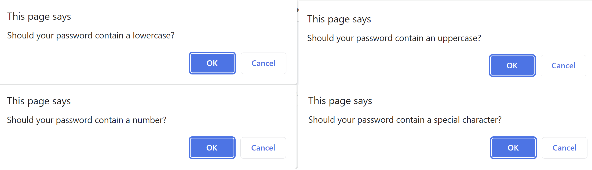

# Password generator

## Description
This application can be used to generate a random password based on criteria a user have selected. This application will run in the browser.

## Usage
When the button 'Generate Password' is clicked, a series of prompts will appear: 
* A prompt to enter length of a password, which should be a number between 8 and 128.

    
* The code validates the user input and alerts are presented, if incorrect input was entered.

    
* After a password length is entered and validated, the user is presented with prompts to choose character types to be included in their password.

    
* The code validates, whether at least one character type has been selected. If no character type has been selected, the user is presented with an alert.

    

Once prompts are answered and validated, the password is generated and written to the page. The generated password will contain at least one of the chosen character types.

## Instalation
N/A

## Link to the deployed application
https://sonia-robin.github.io/password-generator/

## Credits
N/A

## Licences
N/A